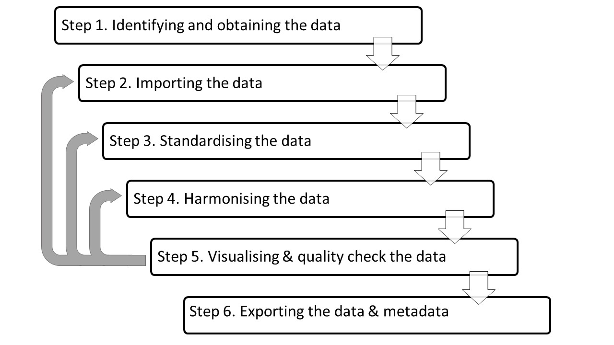

# An open framework and tools to create reproducible food composition data for use in nutrition

This repository contains the scripts necessary to adopt and adapt the open framework and tools to compile transparent and reproducible FCTs and Nutrient Conversion Tables (NCTs). The framework consists in six steps (Figure 1). 

The first three are FCT independent are performed by independent scripts, which are all contained in an individual folder. By using the script `merging_all.R` script all the FCTs available will be standardised and merged. 

The step four is the harmonisation where the construction of the NCT starts, some steps, like the "Food name/ description standardisation and food matching" (see section 3.4 of the manual) are specific to this example use. Other steps, for instance, "re-calculating variables", are generalisables, and hence functions were developed to deal with them. The fuctions are available in the package: [NutritionTools](https://github.com/TomCodd/NutritionTools).

Note: Those FCTs that are publicly available and accessible will be automatically standardised and merged, for the others, the user would need to get raw data into the folder. See the table below for more information on data provenance. 

In addition, this repository contains the script to replicate the compilation of the fish and other aquatic products subset of the Global NCT for Food and Agriculture Organization of the United Nations (FAO) Supply and Utilization Accounts (SUAs) developed by FAO’s Food and Nutrition Division. As well, as the expansion of nine nutrients for the same subset. For generating the fish and other aquatic products subset of the Global NCT, run the "Summary_Table_Production.R".

This repository has a data dependencies which are not available here. 

